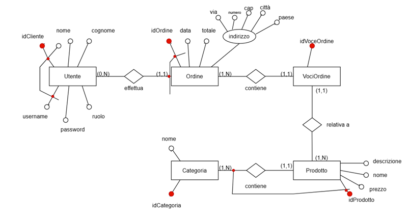

TechStore (nel seguito chiamato semplicemente “Azienda”) è un’azienda che offre ai propri clienti un servizio su scala nazionale, per effettuare ordini di prodotti hi-tech di diverso tipo e categoria. Invece, il portale TechStore (nel seguito chiamato semplicemente “Sistema”) è il sistema di tipo Client – Server, utilizzato dall’azienda TechStore per la gestione del servizio degli ordini.  
Il Sistema consente:

- Agli Admin aziendali, di gestire le informazioni sui prodotti disponibili nello store;
- Ai clienti, di effettuare ordini in modo semplice ed agevole.

Alcune osservazioni e regole relative al dominio:

- Lo store è gestito esclusivamente dagli amministratori. Ognuno di quest’ultimi è una “persona fisica”, responsabile legalmente della gestione di quest’ultimo;
- Lo store si presenta, di base, suddiviso in categorie, ognuna delle quali è composta da un insieme di prodotti caratterizzati da un nome (ad es., Computer Portatile), una descrizione (ad es., vengono specificate le caratteristiche hardware e software di maggior rilievo) e un prezzo unitario (ad es., €450).
- Ciascun ordine comprende uno o più prodotti, ciascuno dei quali è rappresentato da una voce dell’ordine; ogni voce è relativa ad un solo prodotto (presente, ovviamente, nello store), e può specificare anche degli eventuali prodotti aggiuntivi. Infine, ciascun ordine indica l’indirizzo di consegna, nonché la data e l’orario desiderato per la consegna. 

L’uso del sistema in discussione è descritto principalmente di seguenti caso d’uso:

_Caso d’uso UC1: Inserimento nuovo ordine – Attore primario: un Cliente_

1. Un Cliente vuole effettuare un nuovo ordine.
2. Il Cliente inserisce il suo username e la sua password. Il Sistema verifica la correttezza dei dati immessi, e autentica il Cliente. Il Sistema mostra nome e cognome del Cliente.
3. Il Cliente sceglie l’attività “Inserimento Ordine”. Il Sistema mostra l’elenco delle categorie prodotti disponibili nello store.
4. Il Cliente inserisce (selezionandolo da un elenco) il prodotto a cui è interessato.
5. Il Sistema mostra nome, descrizione e prezzo del prodotto selezionato.

_Il Cliente ripete i passi 4 e 5 per ogni prodotto che vuole ordinare, fino a che non indica che ha terminato._

1. Il Sistema mostra un riepilogo dell’ordine, compreso il totale complessivo dell’ordine;
2. Il Cliente inserisce indirizzo, data e orario desiderato per la consegna, e conferma l’ordine. Il Sistema registra l’ordine.

_Estensioni_:

- 2a: Credenziali del Cliente non valide. Il Sistema termina l’esecuzione del caso d’uso;
- 3-8a: Il Cliente annulla l’operazione di inserimento. Il Sistema non registra nessuna informazione sull’ordine.

_Caso d’uso UC2: Aggiornamento Categoria Prodotto – Attore Primario: un Admin_

1. Un Admin vuole modificare una categoria prodotto.
2. L’Admin inserisce il suo username e la sua password. Il sistema verifica la correttezza dei dati immessi, e autentica l’Admin. Il sistema mostra l’username dell’Admin;
3. L’Admin sceglie l’attività “Categoria”. Il Sistema mostra l’elenco delle categorie disponibili all’interno dello store;
4. L’Admin seleziona “Modifica”. Il sistema mostra i dati associati alla categoria selezionata e offre la possibilità di modificare ogni campo della categoria, quali nome, descrizione e immagine.
5. L’Admin inserisce i dati e conclude la modifica. Il sistema salva le modifiche effettuate e le rende visibili pubblicamente all’interno dello store.

_Caso d’uso UC3: Cancellazione di un prodotto – Attore Primario: un Admin_

1. Un Admin vuole eliminare un prodotto dallo store;
2. L’Admin inserisce il suo username e la sua password. Il sistema verifica la correttezza dei dati immessi, e autentica l’Admin. Il sistema mostra l’username dell’Admin;
3. L’Admin sceglie l’attività “Prodotti”. Il sistema mostra l’elenco dei prodotti presenti nello store.
4. L’Admin seleziona “Elimina”. Il sistema elimina il prodotto selezionato e rende la modifica persistente all’interno del sistema.

_Caso d’uso UC4: Visualizzazione degli Ordini Effettuati – Attore Primario: un Cliente_

1. Un Cliente vuole visionare tutti gli ordini che ha effettuato;
2. Il Cliente inserisce il suo username e la sua password. Il sistema verifica la correttezza dei dati immessi, e autentica l’Admin. Il sistema mostra l’username del Cliente;
3. Il Cliente seleziona “Profilo”.
4. Il Sistema mostra tutti i dettagli personali del cliente, quali: nome, cognome ed e-mail. Inoltre, mostra tutti gli ordini effettuati dal Cliente.

_Caso d’uso UC6: Visualizzazione degli Utenti Registrati – Attore Primario: un Admin_

1. Un Admin vuole visualizzare tutti gli utenti registrati al suo e-commerce;
2. L’Admin inserisce il suo username e la sua password. Il sistema verifica la correttezza dei dati immessi, e autentica l’Admin. Il sistema mostra l’username dell’Admin;
3. L’Admin seleziona “Utenti”;
4. Il sistema mostra l’elenco degli utenti registrati allo store con nome, cognome ed username;

| **Draw.io** | Applicazione gratuita e open-source per la creazione di diagrammi UML. |
| --- | --- |

**MODELLO DI DOMINIO**:

**PROGETTAZIONE LATO DB**: (PostgreSQL)

DIAGRAMMA ENTITA’-RELAZIONE

- Un Cliente può effettuare 0 o più ordini (con lo zero si indica la partecipazione opzionale) e un ordine è relativo ad un solo cliente;
- Un Ordine ha una o più voci e ogni voceOrdine è relativa ad un singolo ordine;
- Ogni voceOrdine è relativa ad un singolo Prodotto e ogni Prodotto può essere associato a 1 o più vociOrdine;
- Ogni prodotto appartiene ad una categoria e ogni categoria contiene uno o più prodotti;

Scelte progettuali rilevanti:

- L’Entità Utente racchiude i concetti di Cliente e Amministratore, differenziati da una role based, ovvero un approccio basato sui ruoli come meccanismo di controllo degli accessi e spartizione dei privilegi;

Tabella riepilogativa sulle scelte dei vincoli nel database

| Tabella Figlia | Colonna FK | Tabella Padre | Colonna PK | ON DELETE | Perché | ON UPDATE | Perché |
| --- | --- | --- | --- | --- | --- | --- | --- |
| Prodotto | idCategoria | Categoria | idCategoria | Restrict | Non si può eliminare una categoria finché si hanno prodotti associati | Cascade | Se l’ID categoria cambia, aggiorna automaticamente i riferimenti nei prodotti |
| Ordine | idCliente | Utente | idCliente | Restrict | Non si può cancellare un utente con ordini | Cascade | Se si aggiorna l’ID utente(raro), lo aggiorna anche in ordine |
| Voce   Ordine | idOrdine | Ordine | idOrdine | Cascade | Se un ordine viene cancellato, vengono cancellate tutte le sue voci | Cascade | Se l’ID dell’ordine cambia, lo aggiorna automaticamente anche nelle voci |
| Voce   Ordine | idProdotto | Prodotto | idProdotto | Restrict | Non si può eliminare un prodotto se è stato incluso almeno in un ordine | Cascade | Se l’ID prodotto cambia (raro), aggiorna automaticamente il riferimento in VoceOrdine. |

**Tecnologie Utilizzate**
- Springboot: Framework base per l'avvio e la configurazione dell'applicazione Spring;
- Spring Web: Gestisce le richieste HTTP;
- Spring Data JPA: Facilita l'interazione con il database tramite repository e query automatiche;
- PostgreSQL: Sistema di gestione di database relazionali utilizzato per la persistenza dei dati;
- HTML: Utilizzato per strutturare le pagine web dell'applicazione;
- CSS: Responsabile dello stile e della presentazione visiva dell'interfaccia utente;
- Thymeleaf: Motore di template per integrare dati dinamici nelle pagine HTML lato server;
- Spring Security: Fornisce l'autenticazione e autorizzazione per proteggere l'applicazione;
- Oauth2: Permette l'autenticazione tramite provider esterni come Google;
- Jasypt: Cifra credenziali sensibili nei file di configurazione per una maggiore sicurezza;
- Spring Email: Gestisce l'invio di email dall'applicazione;
- LogBack: Sistema di logging per tracciare eventi e accessi all'applicazione;
- Validation: Valida i dati inseriti dagli utenti nei form per garantirne correttezza e integrità
- Data Transfer Object (DTO): Oggetti utilizzati per trasferire dati tra frontend e backend in modo sicuro e strutturato;
- Spring DevTools: Offre funzionalità utili in fase di sviluppo come il reload automatico e live refresh;
